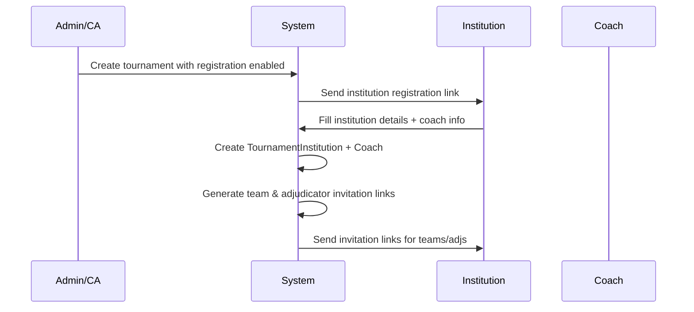
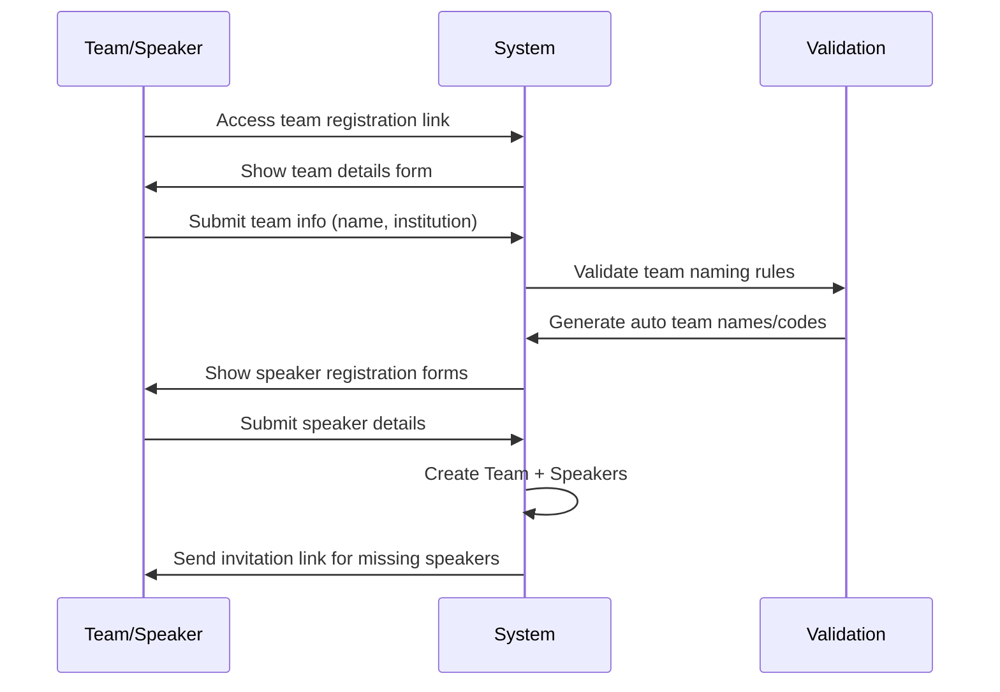
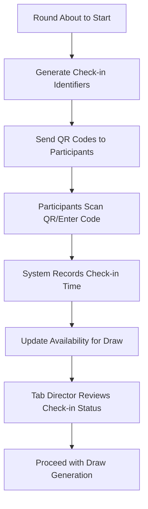
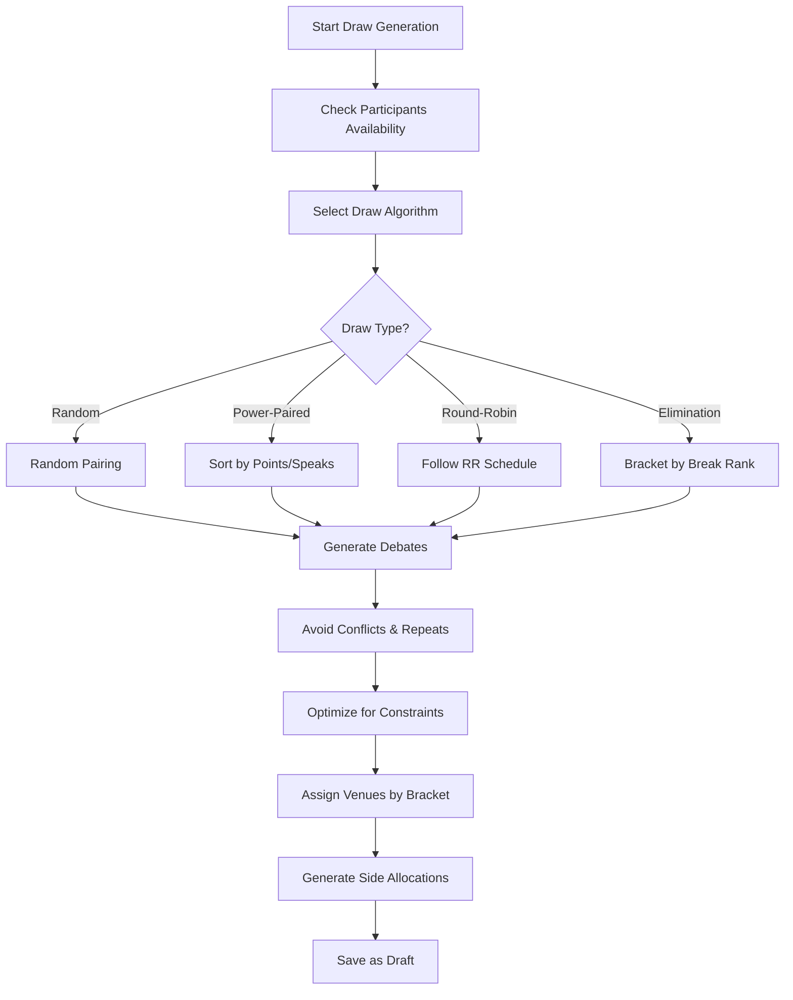
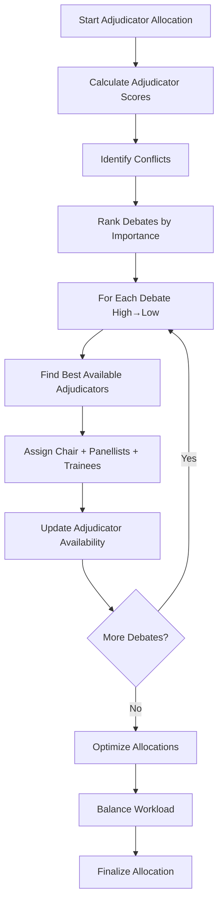
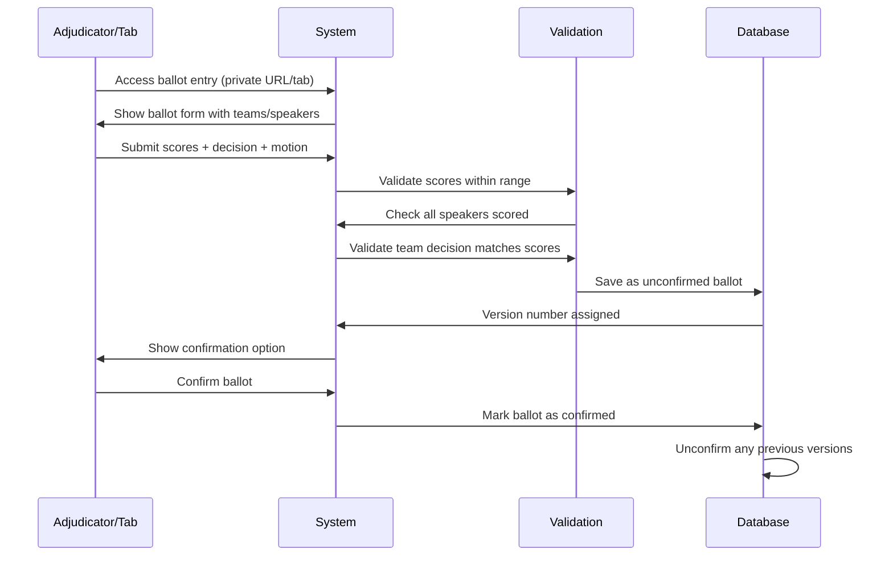
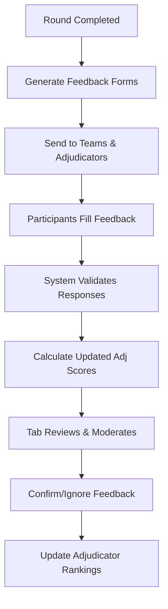

# Analisis Mendalam Sistem Tabbycat Tournament Management

> **Dokumentasi Lengkap untuk Pengembangan Sistem Tournament Management dengan React TypeScript + Tailwind CSS + PostgreSQL (Supabase)**

## 🎯 Ringkasan Eksekutif

Tabbycat adalah sistem manajemen turnamen debat berbasis Django yang sangat sophisticated dengan arsitektur modular. Sistem ini mengelola seluruh lifecycle tournament dari pendaftaran hingga penentuan pemenang dengan fitur real-time, API komprehensif, dan interface yang user-friendly.

---

## 📊 Arsitektur Database dan Model Utama

### 1. **Core Tournament Model**

```python
# Tournament adalah entitas utama
class Tournament(models.Model):
    name = models.CharField(max_length=100)           # Nama lengkap turnamen
    short_name = models.CharField(max_length=25)      # Nama pendek untuk menu
    slug = models.SlugField(unique=True)              # URL identifier
    active = models.BooleanField(default=True)        # Status aktif
    seq = models.IntegerField()                       # Urutan tampilan

    # Properties penting:
    @property
    def sides(self):                                  # Sides: AFF/NEG atau OG/OO/CG/CO
    @property  
    def current_round(self):                          # Round yang sedang berjalan
    @property
    def current_rounds(self):                         # Multiple current rounds untuk break
```

**Supabase Schema Equivalent:**
```sql
CREATE TABLE tournaments (
    id BIGSERIAL PRIMARY KEY,
    name VARCHAR(100) NOT NULL,
    short_name VARCHAR(25),
    slug VARCHAR(50) UNIQUE NOT NULL,
    active BOOLEAN DEFAULT true,
    seq INTEGER,
    created_at TIMESTAMPTZ DEFAULT NOW(),
    updated_at TIMESTAMPTZ DEFAULT NOW()
);
```

### 2. **Participant Management System**

#### **Institution Model**
```python
class Institution(models.Model):
    name = models.CharField(max_length=100)           # Nama institusi lengkap
    code = models.CharField(max_length=20)            # Kode singkat institusi
    region = models.ForeignKey(Region)                # Regional grouping
    
class TournamentInstitution(models.Model):           # Many-to-many relationship
    tournament = models.ForeignKey(Tournament)
    institution = models.ForeignKey(Institution)
    teams_requested = models.PositiveIntegerField()   # Tim yang diminta
    teams_allocated = models.PositiveIntegerField()   # Tim yang dialokasikan
    adjudicators_requested = models.PositiveIntegerField()
    adjudicators_allocated = models.PositiveIntegerField()
```

#### **Team Model**
```python
class Team(models.Model):
    tournament = models.ForeignKey(Tournament)
    institution = models.ForeignKey(Institution)
    reference = models.CharField(max_length=150)      # Nama/suffix tim
    short_reference = models.CharField(max_length=35) # Nama pendek
    code_name = models.CharField(max_length=150)      # Nama samaran untuk publik
    seed = models.PositiveIntegerField()              # Seeding awal
    
    # Auto-generated fields
    short_name = models.CharField(editable=False)     # Auto: "Institution Code + Reference"
    long_name = models.CharField(editable=False)      # Auto: "Institution Name + Reference"
    
    # Special team types
    TYPE_CHOICES = [
        ('N', 'none'),        # Tim normal
        ('S', 'swing'),       # Tim pengganti
        ('C', 'composite'),   # Tim gabungan
        ('B', 'bye'),         # Tim bye
    ]
    type = models.CharField(choices=TYPE_CHOICES)
    
    # Break eligibility
    break_categories = models.ManyToManyField(BreakCategory)
```

#### **Speaker Model**
```python
class Speaker(Person):                                # Inherits from Person
    team = models.ForeignKey(Team)
    categories = models.ManyToManyField(SpeakerCategory) # ESL, Novice, etc.
    
class Person(models.Model):                           # Base model untuk semua participant
    name = models.CharField(max_length=70)
    email = models.EmailField()
    phone = models.CharField(max_length=40)
    anonymous = models.BooleanField()                 # Untuk proteksi privasi
    code_name = models.CharField(max_length=25)       # Nama samaran
    url_key = models.SlugField(unique=True)           # Private URL access
    
    GENDER_CHOICES = [('M', 'male'), ('F', 'female'), ('O', 'other')]
    gender = models.CharField(choices=GENDER_CHOICES)
    pronoun = models.CharField(max_length=10)
```

#### **Adjudicator Model**
```python
class Adjudicator(Person):
    tournament = models.ForeignKey(Tournament)
    institution = models.ForeignKey(Institution)
    base_score = models.FloatField()                  # Skor base adjudicator
    
    # Special properties
    trainee = models.BooleanField()                   # Selalu trainee, tidak boleh chair
    breaking = models.BooleanField()                  # Adjudicator breaking
    independent = models.BooleanField()               # Independent dari institusi
    adj_core = models.BooleanField()                  # Bagian dari adjudication core
    
    # Conflict management
    institution_conflicts = models.ManyToManyField(Institution)
    team_conflicts = models.ManyToManyField(Team)
    adjudicator_conflicts = models.ManyToManyField('self')
```

### 3. **Round and Debate System**

#### **Round Model**
```python
class Round(models.Model):
    tournament = models.ForeignKey(Tournament)
    seq = models.PositiveIntegerField()               # Urutan round (1, 2, 3, ...)
    name = models.CharField(max_length=40)            # "Round 1", "Quarterfinals"
    abbreviation = models.CharField(max_length=10)    # "R1", "QF"
    completed = models.BooleanField()                 # Apakah round sudah selesai
    
    # Round types
    STAGE_CHOICES = [('P', 'Preliminary'), ('E', 'Elimination')]
    stage = models.CharField(choices=STAGE_CHOICES)
    
    DRAW_TYPE_CHOICES = [
        ('R', 'Random'),
        ('M', 'Manual'), 
        ('D', 'Round-robin'),
        ('P', 'Power-paired'),      # Berdasarkan ranking
        ('E', 'Elimination'),       # Knockout system
        ('S', 'Seeded'),           # Berdasarkan seed
    ]
    draw_type = models.CharField(choices=DRAW_TYPE_CHOICES)
    
    # Draw status
    STATUS_CHOICES = [('N', 'None'), ('D', 'Draft'), ('C', 'Confirmed'), ('R', 'Released')]
    draw_status = models.CharField(choices=STATUS_CHOICES)
    
    # Break rounds
    break_category = models.ForeignKey(BreakCategory)  # Untuk elimination rounds
    
    # Feedback and timing
    feedback_weight = models.FloatField()             # Bobot feedback vs base score
    silent = models.BooleanField()                    # Silent round (tidak dipublikasi)
    motions_released = models.BooleanField()
    starts_at = models.DateTimeField()
    weight = models.IntegerField(default=1)           # Multiplier untuk poin
```

#### **Debate Model**
```python
class Debate(models.Model):
    round = models.ForeignKey(Round)
    venue = models.ForeignKey(Venue)
    
    # Bracket and importance
    bracket = models.FloatField()                     # Bracket strength (higher = stronger teams)
    room_rank = models.IntegerField()                 # Room quality ranking
    importance = models.IntegerField()                # Importance level (-2 to +2)
    
    # Status tracking
    STATUS_CHOICES = [
        ('N', 'none'), ('P', 'postponed'), 
        ('D', 'draft'), ('C', 'confirmed')
    ]
    result_status = models.CharField(choices=STATUS_CHOICES)
    sides_confirmed = models.BooleanField()           # Sides sudah final atau masih placeholder
    
    # Draw generation flags
    flags = ChoiceArrayField()                        # Metadata untuk draw generation
```

#### **DebateTeam Model** (Junction table untuk teams dalam debate)
```python
class DebateTeam(models.Model):
    debate = models.ForeignKey(Debate)
    team = models.ForeignKey(Team)
    side = models.PositiveIntegerField()              # 0=AFF, 1=NEG (atau 0,1,2,3 untuk BP)
```

### 4. **Results and Scoring System**

#### **Ballot Submission System**
```python
class BallotSubmission(Submission):                   # Inherits versioning and confirmation
    debate = models.ForeignKey(Debate)
    motion = models.ForeignKey(Motion)
    
    # Participant results
    class Submitter(models.TextChoices):
        TABROOM = 'T'
        PUBLIC = 'P'  
        AUTOMATION = 'A'
    
    submitter_type = models.CharField(choices=Submitter.choices)
    confirmed = models.BooleanField()                 # Only one confirmed ballot per debate
    
class TeamScore(models.Model):
    ballot_submission = models.ForeignKey(BallotSubmission)
    debate_team = models.ForeignKey(DebateTeam)
    points = models.PositiveIntegerField()            # Team points (1 for win, 0 for loss)
    win = models.BooleanField()                       # Did team win?
    
class SpeakerScore(models.Model):
    ballot_submission = models.ForeignKey(BallotSubmission)
    speaker = models.ForeignKey(Speaker)
    position = models.IntegerField()                  # Speaking position (1, 2, 3, Reply)
    score = models.FloatField()                       # Speaking score
```

### 5. **Feedback System**

#### **Adjudicator Feedback**
```python
class AdjudicatorFeedback(Submission):
    adjudicator = models.ForeignKey(Adjudicator)      # Target adjudicator
    score = models.FloatField()                       # Overall score
    
    # Sources (exactly one must be set)
    source_adjudicator = models.ForeignKey(DebateAdjudicator)  # From other adj
    source_team = models.ForeignKey(DebateTeam)               # From team
    
    ignored = models.BooleanField()                   # Ignore this feedback?
    
class AdjudicatorFeedbackQuestion(Question):
    reference = models.SlugField()                    # Code reference
    from_adj = models.BooleanField()                  # Ask adjudicators this?
    from_team = models.BooleanField()                 # Ask teams this?
```

### 6. **Registration and Check-in System**

#### **Registration Questions**
```python
class Question(models.Model):
    tournament = models.ForeignKey(Tournament)
    for_content_type = models.ForeignKey(ContentType) # Institution/Team/Adjudicator/Speaker
    text = models.CharField(max_length=255)           # Question text
    
    ANSWER_TYPE_CHOICES = [
        ('bc', 'checkbox'), ('bs', 'yes/no dropdown'),
        ('i', 'integer textbox'), ('is', 'integer scale'),
        ('f', 'float'), ('t', 'text'), ('tl', 'long text'),
        ('ss', 'select one'), ('ms', 'select multiple'),
        ('dt', 'date + time')
    ]
    answer_type = models.CharField(choices=ANSWER_TYPE_CHOICES)
    required = models.BooleanField()
    choices = ArrayField(models.TextField())          # For select fields
    
class Answer(models.Model):                           # Generic foreign key to any participant
    question = models.ForeignKey(Question)
    content_type = models.ForeignKey(ContentType)
    object_id = models.PositiveIntegerField()
    content_object = GenericForeignKey()
    answer = models.TextField()                       # JSON-stored answer
```

#### **Invitation System**
```python
class Invitation(models.Model):
    tournament = models.ForeignKey(Tournament)
    for_content_type = models.ForeignKey(ContentType) # Team/Adjudicator/Institution
    institution = models.ForeignKey(Institution)      # Optional: restrict by institution
    team = models.ForeignKey(Team)                    # Optional: restrict to specific team
    url_key = models.CharField(max_length=50)         # Unique access key
    created_on = models.DateTimeField(auto_now=True)
```

---

## 🔄 Alur Kerja Sistem (Workflow Analysis)

### **Phase 1: Tournament Setup**

#### 1.1 Tournament Creation
```python
# Admin creates tournament
tournament = Tournament.objects.create(
    name="Asian Universities Debating Championship 2024",
    short_name="AUDC 2024", 
    slug="audc2024"
)

# Setup basic configuration
tournament.pref('teams_in_debate', 2)      # 2-team or 4-team format
tournament.pref('speakers_in_team', 2)     # Speakers per team
tournament.pref('substantive_speakers', 2) # Non-reply speakers
tournament.pref('reply_scores_enabled', True)
```

#### 1.2 Tournament Configuration
- **Format Configuration**: 2-team vs 4-team (British Parliamentary)
- **Scoring System**: Speaker score ranges, team point allocation
- **Break Categories**: Open, ESL, Novice, etc.
- **Speaker Categories**: Gender, experience level, language categories
- **Venue Categories**: Room quality rankings
- **Feedback Questions**: Custom questions for adjudicator evaluation

#### 1.3 Data Import/Setup
```python
# Import institutions
Institution.objects.bulk_create([
    Institution(name="University of Oxford", code="Oxford", region=uk_region),
    Institution(name="Harvard University", code="Harvard", region=usa_region),
])

# Create break categories
BreakCategory.objects.create(
    tournament=tournament,
    name="Open",
    slug="open", 
    is_general=True,  # Default category
    break_size=16     # How many teams break
)
```

### **Phase 2: Registration Workflow**

#### 2.1 Institution Registration


**Implementation di React:**
```typescript
// Institution Registration Form
interface InstitutionRegistration {
  institutionName: string;
  institutionCode: string;
  region: string;
  teamsRequested: number;
  adjudicatorsRequested: number;
  coachName: string;
  coachEmail: string;
  customAnswers: Record<string, any>;
}

const registerInstitution = async (data: InstitutionRegistration) => {
  const response = await supabase
    .from('tournament_institutions')
    .insert({
      tournament_id: tournamentId,
      institution_id: institutionId,
      teams_requested: data.teamsRequested,
      adjudicators_requested: data.adjudicatorsRequested
    });
    
  // Generate invitations
  const invitations = [
    { for_content_type: 'team', url_key: generateUniqueKey() },
    { for_content_type: 'adjudicator', url_key: generateUniqueKey() }
  ];
  
  await supabase.from('invitations').insert(invitations);
};
```

#### 2.2 Team Registration Process


**Team Naming System:**
```python
# Sistem naming otomatis untuk teams
REFERENCE_GENERATORS = {
    'user': 'User-defined names',
    'alphabetical': 'A, B, C, D...',  
    'numerical': '1, 2, 3, 4...',
    'initials': 'Speaker initials (e.g., JD-MS)'
}

CODE_NAME_GENERATORS = {
    'user': 'User-defined codes',
    'emoji': 'Random emoji assignments', 
    'last_names': 'Speaker last names'
}

# Example: Oxford A vs Cambridge 1
team.short_name = "Oxford A"  # institution.code + reference
team.long_name = "University of Oxford A"  # institution.name + reference
team.code_name = "🦄"  # For public display when anonymized
```

#### 2.3 Adjudicator Registration
```typescript
interface AdjudicatorRegistration {
  personalDetails: {
    name: string;
    email: string;
    phone?: string;
    gender?: 'M' | 'F' | 'O';
    pronouns?: string;
  };
  adjudicationDetails: {
    institution?: string;
    baseScore: number;        // Initial adjudicator rating
    independent: boolean;     // Independent of institution?
    trainee: boolean;         // Always trainee (never chair)?
    breaking: boolean;        // Breaking adjudicator?
    adjCore: boolean;         // Part of adj core?
  };
  conflicts: {
    institutionConflicts: string[];
    teamConflicts: string[];
    adjudicatorConflicts: string[];
  };
  customAnswers: Record<string, any>;
}
```

### **Phase 3: Check-in System**

#### 3.1 Pre-Round Check-in Process


**Check-in Implementation:**
```typescript
interface CheckinStatus {
  participantId: string;
  participantType: 'team' | 'adjudicator' | 'venue';
  checkedIn: boolean;
  checkinTime?: Date;
  identifier?: string;  // QR code or unique identifier
}

const handleCheckin = async (identifier: string) => {
  const participant = await supabase
    .from('checkin_identifiers')
    .select('*, participant:participants(*)')
    .eq('identifier', identifier)
    .single();
    
  if (!participant) throw new Error('Invalid identifier');
  
  await supabase
    .from('checkin_status')
    .upsert({
      participant_id: participant.participant_id,
      round_id: currentRound.id,
      checked_in: true,
      checkin_time: new Date().toISOString()
    });
};
```

### **Phase 4: Draw Generation**

#### 4.1 Draw Generation Algorithm


**Power-Pairing Algorithm:**
```python
def generate_power_paired_draw(round, teams):
    # 1. Calculate team standings
    teams_with_stats = []
    for team in teams:
        stats = calculate_team_stats(team, round)
        teams_with_stats.append({
            'team': team,
            'points': stats['points'],
            'speaks': stats['speaks'],
            'bracket': stats['points']  # Primary sort by points
        })
    
    # 2. Sort teams by bracket (points), then by speaks
    teams_with_stats.sort(key=lambda x: (-x['bracket'], -x['speaks']))
    
    # 3. Group teams by bracket
    brackets = {}
    for team_stat in teams_with_stats:
        bracket = team_stat['bracket']
        if bracket not in brackets:
            brackets[bracket] = []
        brackets[bracket].append(team_stat['team'])
    
    # 4. Pair within brackets, avoid repeats and conflicts
    debates = []
    for bracket_teams in brackets.values():
        bracket_debates = pair_teams_in_bracket(
            bracket_teams, 
            avoid_conflicts=True,
            avoid_repeats=True,
            previous_rounds=round.tournament.round_set.filter(seq__lt=round.seq)
        )
        debates.extend(bracket_debates)
    
    return debates

def pair_teams_in_bracket(teams, avoid_conflicts=True, avoid_repeats=True, previous_rounds=None):
    """Hungarian algorithm or greedy pairing within bracket"""
    # Implementation focuses on:
    # 1. Institutional conflicts (same institution teams can't debate)
    # 2. History conflicts (teams that have already debated)
    # 3. Regional diversity (prefer mixing regions)
    # 4. Venue constraints
```

#### 4.2 Side Allocation
```python
def allocate_sides(debates, round):
    """Allocate AFF/NEG (or OG/OO/CG/CO for BP) sides to teams"""
    
    for debate in debates:
        teams = debate.teams
        
        if round.tournament.pref('teams_in_debate') == 2:
            # Two-team format (AFF/NEG)
            side_history = calculate_side_history(teams, round)
            
            # Prefer to balance side history
            if side_history[teams[0]]['aff_count'] > side_history[teams[1]]['aff_count']:
                assign_sides(debate, {teams[1]: 'AFF', teams[0]: 'NEG'})
            else:
                assign_sides(debate, {teams[0]: 'AFF', teams[1]: 'NEG'})
                
        elif round.tournament.pref('teams_in_debate') == 4:
            # British Parliamentary (OG/OO/CG/CO)
            side_history = calculate_bp_side_history(teams, round)
            optimal_allocation = optimize_bp_sides(teams, side_history)
            assign_sides(debate, optimal_allocation)
```

### **Phase 5: Adjudicator Allocation**

#### 5.1 Auto-Allocation Algorithm


**Allocation Logic:**
```python
class AdjudicatorAllocation:
    def allocate_for_round(self, round):
        debates = round.debate_set.all().order_by('-importance', '-bracket')
        adjudicators = self.get_available_adjudicators(round)
        
        for debate in debates:
            # Calculate required panel size
            panel_size = self.get_panel_size(debate.importance)
            
            # Find best adjudicators for this debate
            suitable_adjs = self.filter_conflicts(adjudicators, debate)
            suitable_adjs = self.score_adjudicators(suitable_adjs, debate)
            
            # Assign panel
            panel = {
                'chair': suitable_adjs[0] if not suitable_adjs[0].trainee else None,
                'panellists': suitable_adjs[1:panel_size-1],
                'trainees': [adj for adj in suitable_adjs[:panel_size] if adj.trainee]
            }
            
            self.assign_panel(debate, panel)
            
            # Remove allocated adjudicators from available pool
            adjudicators = [adj for adj in adjudicators if adj not in panel.values()]
    
    def score_adjudicators(self, adjudicators, debate):
        """Score adjudicators based on multiple factors"""
        scored_adjs = []
        
        for adj in adjudicators:
            score = 0
            
            # Base adjudicator score (with feedback)
            score += adj.weighted_score(debate.round.feedback_weight)
            
            # Diversity bonus (regional, institutional)
            score += self.calculate_diversity_bonus(adj, debate)
            
            # Experience bonus for important debates
            if debate.importance > 0 and adj.breaking:
                score += 2
            
            # Penalty for overwork
            score -= self.calculate_workload_penalty(adj, debate.round)
            
            scored_adjs.append((adj, score))
        
        return [adj for adj, score in sorted(scored_adjs, key=lambda x: -x[1])]
```

### **Phase 6: Results Entry**

#### 6.1 Ballot Submission Workflow


**Ballot Validation Rules:**
```typescript
interface BallotData {
  debateId: string;
  motionId: string;
  teamScores: Array<{
    teamId: string;
    points: number;      // 1 for win, 0 for loss
    win: boolean;
  }>;
  speakerScores: Array<{
    speakerId: string;
    position: number;    // 1, 2, 3, Reply
    score: number;       // Within min/max range
  }>;
  adjudicators: Array<{
    adjudicatorId: string;
    type: 'chair' | 'panellist' | 'trainee';
  }>;
}

const validateBallot = (ballot: BallotData, tournament: Tournament) => {
  const errors: string[] = [];
  
  // 1. Score range validation
  const minScore = tournament.preferences.min_speaker_score;
  const maxScore = tournament.preferences.max_speaker_score;
  
  ballot.speakerScores.forEach(score => {
    if (score.score < minScore || score.score > maxScore) {
      errors.push(`Speaker score ${score.score} outside allowed range`);
    }
  });
  
  // 2. Team decision consistency
  const winningTeams = ballot.teamScores.filter(ts => ts.win).length;
  if (winningTeams !== 1) {
    errors.push('Exactly one team must be marked as winner');
  }
  
  // 3. Speaker coverage
  const expectedSpeakers = tournament.preferences.speakers_in_team * 
                          tournament.preferences.teams_in_debate;
  if (ballot.speakerScores.length !== expectedSpeakers) {
    errors.push('Not all speakers have been scored');
  }
  
  return errors;
};
```

### **Phase 7: Feedback Collection**

#### 7.1 Feedback Workflow


**Feedback Processing:**
```python
def process_adjudicator_feedback(feedback_submission):
    """Process feedback and update adjudicator scores"""
    
    adj = feedback_submission.adjudicator
    
    # Get all confirmed, non-ignored feedback
    all_feedback = AdjudicatorFeedback.objects.filter(
        adjudicator=adj,
        confirmed=True,
        ignored=False
    ).exclude(
        source_adjudicator__type='trainee'  # Exclude trainee feedback
    )
    
    if all_feedback.exists():
        # Calculate average feedback score
        avg_feedback = all_feedback.aggregate(Avg('score'))['score__avg']
        
        # Update adjudicator's cached feedback score
        adj._feedback_score_cache = avg_feedback
        adj.save()
        
        # Trigger recalculation of weighted score for next round
        adj._weighted_score_cache = None
```

### **Phase 8: Standings and Break**

#### 8.1 Standings Calculation
```python
class TeamStandingsGenerator:
    """Calculate team standings with multiple metrics"""
    
    def generate_standings(self, teams, round):
        standings = []
        
        for team in teams:
            stats = self.calculate_team_stats(team, round)
            standings.append({
                'team': team,
                'points': stats['points'],           # Primary: total wins
                'speaks': stats['total_speaks'],     # Secondary: total speaker scores  
                'margins': stats['total_margins'],   # Tertiary: victory margins
                'draw_strength': stats['opp_points'], # Quaternary: opposition strength
            })
        
        # Sort by multiple criteria
        standings.sort(key=lambda x: (
            -x['points'],          # Most wins first
            -x['speaks'],          # Highest speaks second
            -x['margins'],         # Highest margins third
            -x['draw_strength']    # Strongest opposition fourth
        ))
        
        return standings
    
    def calculate_team_stats(self, team, round):
        """Calculate comprehensive team statistics"""
        team_scores = TeamScore.objects.filter(
            debate_team__team=team,
            ballot_submission__confirmed=True,
            debate_team__debate__round__seq__lte=round.seq
        ).select_related('debate_team__debate')
        
        points = team_scores.filter(win=True).count()
        
        # Speaker scores for this team
        speaker_scores = SpeakerScore.objects.filter(
            speaker__team=team,
            ballot_submission__confirmed=True,
            ballot_submission__debate__round__seq__lte=round.seq
        )
        
        total_speaks = speaker_scores.aggregate(Sum('score'))['score__sum'] or 0
        
        # Calculate margins and opposition strength
        total_margins = 0
        opposition_points = 0
        
        for ts in team_scores:
            debate = ts.debate_team.debate
            our_score = self.get_team_total_score(team, debate)
            opp_scores = [
                self.get_team_total_score(dt.team, debate) 
                for dt in debate.debateteam_set.exclude(team=team)
            ]
            
            if ts.win:
                total_margins += our_score - max(opp_scores)
            
            # Add opposition strength
            for opp_team in [dt.team for dt in debate.debateteam_set.exclude(team=team)]:
                opp_wins = TeamScore.objects.filter(
                    debate_team__team=opp_team,
                    win=True,
                    ballot_submission__confirmed=True
                ).count()
                opposition_points += opp_wins
        
        return {
            'points': points,
            'total_speaks': total_speaks,
            'total_margins': total_margins,
            'opp_points': opposition_points
        }
```

#### 8.2 Break Determination
```python
class BreakGenerator:
    """Determine which teams break to elimination rounds"""
    
    def generate_break(self, category, round):
        """Generate break for a specific category"""
        
        # Get eligible teams
        eligible_teams = category.team_set.all()
        
        # Calculate standings
        standings = TeamStandingsGenerator().generate_standings(eligible_teams, round)
        
        # Apply break size
        breaking_teams = standings[:category.break_size]
        
        # Handle ties at break line
        if len(standings) > category.break_size:
            cutoff_team = standings[category.break_size - 1]
            tied_teams = [
                team for team in standings 
                if self.teams_are_tied(team, cutoff_team)
            ]
            
            if len(tied_teams) > 1:
                # Apply tiebreaker rules
                breaking_teams = self.resolve_ties(tied_teams, category.break_size)
        
        # Create BreakingTeam objects
        BreakingTeam.objects.filter(break_category=category).delete()
        
        for rank, team_data in enumerate(breaking_teams, 1):
            BreakingTeam.objects.create(
                break_category=category,
                team=team_data['team'],
                break_rank=rank,
                remark='auto'  # or 'override' for manual adjustments
            )
        
        return breaking_teams
    
    def teams_are_tied(self, team1, team2):
        """Check if two teams are tied on all break criteria"""
        return (team1['points'] == team2['points'] and
                team1['speaks'] == team2['speaks'] and  
                team1['margins'] == team2['margins'])
```

---

## 🎛️ Admin Interface dan Features

### **1. Tournament Management Dashboard**
```typescript
interface TournamentDashboard {
  currentRound: Round;
  nextActions: Array<{
    action: 'generate_draw' | 'allocate_adjs' | 'release_draw' | 'enter_results';
    urgent: boolean;
    description: string;
  }>;
  participantStatus: {
    teamsRegistered: number;
    teamsCheckedIn: number;
    adjudicatorsAvailable: number;
    venuesAvailable: number;
  };
  roundStatus: {
    debatesCompleted: number;
    debatesTotal: number;
    ballotsPending: number;
    feedbackPending: number;
  };
}
```

### **2. Real-time Updates & Notifications**
```typescript
// WebSocket integration untuk real-time updates
interface RealtimeUpdate {
  type: 'checkin_status' | 'ballot_submission' | 'feedback_received';
  data: any;
  timestamp: Date;
  affectedUsers: string[];
}

const useRealtimeUpdates = (tournamentId: string) => {
  useEffect(() => {
    const channel = supabase
      .channel(`tournament:${tournamentId}`)
      .on('postgres_changes', {
        event: '*',
        schema: 'public',
        table: 'checkin_status'
      }, handleCheckinUpdate)
      .on('postgres_changes', {
        event: '*', 
        schema: 'public',
        table: 'ballot_submissions'
      }, handleBallotUpdate)
      .subscribe();
      
    return () => supabase.removeChannel(channel);
  }, [tournamentId]);
};
```

### **3. Public Interface Features**
```typescript
interface PublicViews {
  // Tournament information
  tournamentInfo: {
    name: string;
    schedule: Round[];
    motions: Motion[];
    currentRound: Round;
  };
  
  // Live standings (if enabled)
  standings: {
    teamStandings: TeamStanding[];
    speakerStandings: SpeakerStanding[];
    enabled: boolean;
  };
  
  // Draw display (if released)
  draw: {
    debates: Debate[];
    displayMode: 'by_venue' | 'by_team' | 'by_bracket';
    released: boolean;
  };
  
  // Results (if released)
  results: {
    debates: DebateResult[];
    roundComplete: boolean;
  };
  
  // Check-in status (if enabled)
  checkinStatus: {
    teams: CheckinStatus[];
    adjudicators: CheckinStatus[];
    venues: CheckinStatus[];
  };
}
```

---

## 🔧 Technical Implementation Recommendations

### **1. Database Schema (Supabase)**

```sql
-- Core tournament structure
CREATE TABLE tournaments (
    id BIGSERIAL PRIMARY KEY,
    name VARCHAR(100) NOT NULL,
    short_name VARCHAR(25),
    slug VARCHAR(50) UNIQUE NOT NULL,
    active BOOLEAN DEFAULT true,
    current_round_id BIGINT,
    preferences JSONB DEFAULT '{}',
    created_at TIMESTAMPTZ DEFAULT NOW(),
    updated_at TIMESTAMPTZ DEFAULT NOW()
);

-- Institutions and participants
CREATE TABLE institutions (
    id BIGSERIAL PRIMARY KEY,
    name VARCHAR(100) NOT NULL,
    code VARCHAR(20) NOT NULL,
    region_id BIGINT REFERENCES regions(id),
    UNIQUE(name, code)
);

CREATE TABLE tournament_institutions (
    id BIGSERIAL PRIMARY KEY,
    tournament_id BIGINT REFERENCES tournaments(id) ON DELETE CASCADE,
    institution_id BIGINT REFERENCES institutions(id),
    teams_requested INTEGER DEFAULT 0,
    teams_allocated INTEGER DEFAULT 0,
    adjudicators_requested INTEGER DEFAULT 0,
    adjudicators_allocated INTEGER DEFAULT 0,
    UNIQUE(tournament_id, institution_id)
);

CREATE TABLE teams (
    id BIGSERIAL PRIMARY KEY,
    tournament_id BIGINT REFERENCES tournaments(id) ON DELETE CASCADE,
    institution_id BIGINT REFERENCES institutions(id),
    reference VARCHAR(150),
    short_reference VARCHAR(35),
    code_name VARCHAR(150),
    short_name VARCHAR(56) GENERATED ALWAYS AS (
        CASE 
            WHEN use_institution_prefix AND institution_id IS NOT NULL 
            THEN (SELECT code FROM institutions WHERE id = institution_id) || ' ' || COALESCE(short_reference, '')
            ELSE COALESCE(short_reference, reference)
        END
    ) STORED,
    use_institution_prefix BOOLEAN DEFAULT false,
    team_type VARCHAR(1) DEFAULT 'N' CHECK (team_type IN ('N', 'S', 'C', 'B')),
    seed INTEGER,
    emoji VARCHAR(3),
    created_at TIMESTAMPTZ DEFAULT NOW(),
    UNIQUE(tournament_id, institution_id, reference)
);

-- Enable Row Level Security
ALTER TABLE tournaments ENABLE ROW LEVEL SECURITY;
ALTER TABLE teams ENABLE ROW LEVEL SECURITY;

-- RLS Policies
CREATE POLICY "Public tournaments are viewable by everyone" 
ON tournaments FOR SELECT 
USING (active = true);

CREATE POLICY "Team data viewable by tournament participants"
ON teams FOR SELECT
USING (
    tournament_id IN (
        SELECT id FROM tournaments WHERE active = true
    )
);
```

### **2. State Management (Zustand)**

```typescript
interface TournamentStore {
  // Current tournament state
  tournament: Tournament | null;
  currentRound: Round | null;
  
  // Participant data
  teams: Team[];
  adjudicators: Adjudicator[];
  speakers: Speaker[];
  
  // Draw and results
  currentDraw: Debate[];
  currentResults: BallotSubmission[];
  
  // UI state
  loading: boolean;
  error: string | null;
  
  // Actions
  loadTournament: (slug: string) => Promise<void>;
  updateParticipants: () => Promise<void>;
  generateDraw: (roundId: string) => Promise<void>;
  submitBallot: (ballot: BallotData) => Promise<void>;
}

const useTournamentStore = create<TournamentStore>((set, get) => ({
  tournament: null,
  currentRound: null,
  teams: [],
  adjudicators: [],
  speakers: [],
  currentDraw: [],
  currentResults: [],
  loading: false,
  error: null,
  
  loadTournament: async (slug: string) => {
    set({ loading: true, error: null });
    
    try {
      const { data: tournament, error } = await supabase
        .from('tournaments')
        .select(`
          *,
          current_round:rounds(id, name, seq, stage, completed),
          teams:teams(
            id, short_name, code_name, institution:institutions(name, code),
            speakers:speakers(id, name)
          ),
          adjudicators:adjudicators(
            id, name, base_score, institution:institutions(name, code)
          )
        `)
        .eq('slug', slug)
        .single();
        
      if (error) throw error;
      
      set({
        tournament,
        currentRound: tournament.current_round,
        teams: tournament.teams,
        adjudicators: tournament.adjudicators,
        loading: false
      });
    } catch (error) {
      set({ error: error.message, loading: false });
    }
  }
}));
```

### **3. Component Architecture**

```typescript
// Tournament Layout Component
const TournamentLayout: React.FC<{ children: React.ReactNode }> = ({ children }) => {
  const { tournament, loading } = useTournamentStore();
  
  if (loading) return <LoadingSpinner />;
  if (!tournament) return <TournamentNotFound />;
  
  return (
    <div className="min-h-screen bg-gray-50">
      <TournamentHeader tournament={tournament} />
      <div className="flex">
        <TournamentSidebar />
        <main className="flex-1 p-6">
          {children}
        </main>
      </div>
      <TournamentFooter />
    </div>
  );
};

// Draw Generation Component
const DrawGeneration: React.FC = () => {
  const { currentRound, teams, generateDraw } = useTournamentStore();
  const [drawType, setDrawType] = useState<DrawType>('power_paired');
  const [isGenerating, setIsGenerating] = useState(false);
  
  const handleGenerateDraw = async () => {
    setIsGenerating(true);
    try {
      await generateDraw(currentRound.id, { type: drawType });
      toast.success('Draw generated successfully!');
    } catch (error) {
      toast.error('Failed to generate draw');
    } finally {
      setIsGenerating(false);
    }
  };
  
  return (
    <Card className="p-6">
      <CardHeader>
        <h2 className="text-2xl font-bold">Generate Draw - {currentRound.name}</h2>
      </CardHeader>
      
      <CardContent className="space-y-4">
        <DrawTypeSelector value={drawType} onChange={setDrawType} />
        <TeamAvailability teams={teams} />
        
        <Button 
          onClick={handleGenerateDraw}
          disabled={isGenerating}
          className="w-full"
        >
          {isGenerating ? 'Generating...' : 'Generate Draw'}
        </Button>
      </CardContent>
    </Card>
  );
};
```

### **4. Real-time Features Implementation**

```typescript
// Real-time checkin updates
const useCheckinStatus = (tournamentId: string) => {
  const [checkinStatus, setCheckinStatus] = useState<CheckinStatus[]>([]);
  
  useEffect(() => {
    // Initial load
    const loadCheckinStatus = async () => {
      const { data } = await supabase
        .from('checkin_status')
        .select('*')
        .eq('tournament_id', tournamentId);
      setCheckinStatus(data || []);
    };
    
    loadCheckinStatus();
    
    // Subscribe to real-time updates
    const subscription = supabase
      .channel(`checkin:${tournamentId}`)
      .on('postgres_changes', {
        event: '*',
        schema: 'public',
        table: 'checkin_status',
        filter: `tournament_id=eq.${tournamentId}`
      }, (payload) => {
        setCheckinStatus(prev => {
          const updated = [...prev];
          const index = updated.findIndex(item => 
            item.participant_id === payload.new.participant_id
          );
          
          if (index >= 0) {
            updated[index] = payload.new;
          } else {
            updated.push(payload.new);
          }
          
          return updated;
        });
      })
      .subscribe();
      
    return () => {
      supabase.removeChannel(subscription);
    };
  }, [tournamentId]);
  
  return checkinStatus;
};

// Progressive Web App offline support
const useOfflineSupport = () => {
  const [isOnline, setIsOnline] = useState(navigator.onLine);
  const [pendingActions, setPendingActions] = useState<Action[]>([]);
  
  useEffect(() => {
    const handleOnline = () => {
      setIsOnline(true);
      // Sync pending actions when back online
      syncPendingActions();
    };
    
    const handleOffline = () => setIsOnline(false);
    
    window.addEventListener('online', handleOnline);
    window.addEventListener('offline', handleOffline);
    
    return () => {
      window.removeEventListener('online', handleOnline);
      window.removeEventListener('offline', handleOffline);
    };
  }, []);
  
  const queueAction = (action: Action) => {
    if (isOnline) {
      executeAction(action);
    } else {
      setPendingActions(prev => [...prev, action]);
      // Store in localStorage for persistence
      localStorage.setItem('pendingActions', JSON.stringify([...pendingActions, action]));
    }
  };
  
  return { isOnline, queueAction };
};
```

---

## 📱 Mobile-First Design Considerations

### **1. Responsive Layouts**
```typescript
// Mobile-optimized components
const MobileDrawView: React.FC = () => {
  return (
    <div className="md:hidden">
      <Tabs defaultValue="by-venue" className="w-full">
        <TabsList className="grid w-full grid-cols-3">
          <TabsTrigger value="by-venue">Venues</TabsTrigger>
          <TabsTrigger value="by-team">Teams</TabsTrigger>
          <TabsTrigger value="by-bracket">Brackets</TabsTrigger>
        </TabsList>
        
        <TabsContent value="by-venue" className="space-y-2">
          {debates.map(debate => (
            <DebateCard key={debate.id} debate={debate} compact />
          ))}
        </TabsContent>
      </Tabs>
    </div>
  );
};

// Desktop optimized view
const DesktopDrawView: React.FC = () => {
  return (
    <div className="hidden md:block">
      <DataTable
        columns={drawColumns}
        data={debates}
        sorting={true}
        filtering={true}
        pagination={true}
      />
    </div>
  );
};
```

### **2. QR Code Integration**
```typescript
const QRCodeCheckin: React.FC = () => {
  const [scanning, setScanning] = useState(false);
  const { checkinParticipant } = useCheckin();
  
  const handleScan = async (result: string) => {
    try {
      await checkinParticipant(result);
      toast.success('Checked in successfully!');
    } catch (error) {
      toast.error('Invalid QR code');
    }
    setScanning(false);
  };
  
  return (
    <Card className="p-4">
      <CardHeader>
        <h3 className="text-lg font-semibold">Check-in</h3>
      </CardHeader>
      
      <CardContent>
        {scanning ? (
          <QrReader
            onResult={handleScan}
            constraints={{ facingMode: 'environment' }}
            className="w-full"
          />
        ) : (
          <Button onClick={() => setScanning(true)} className="w-full">
            <QrCode className="mr-2 h-4 w-4" />
            Scan QR Code
          </Button>
        )}
      </CardContent>
    </Card>
  );
};
```

---

## 🎯 Key Learning Points untuk Project Anda

### **1. Database Design Principles**
- **Normalisasi yang tepat**: Separate entities dengan relationship yang jelas
- **Versioning system**: Untuk ballot submissions dan feedback
- **Generic foreign keys**: Untuk flexible question-answer system
- **Audit trails**: Track semua perubahan penting
- **Performance optimization**: Proper indexing untuk query yang sering

### **2. State Management Strategy**
- **Centralized store**: Tournament-level state management
- **Real-time updates**: WebSocket integration dengan Supabase
- **Optimistic updates**: Immediate UI feedback dengan rollback capability
- **Offline support**: Queue actions when offline, sync when back online

### **3. User Experience Patterns**
- **Progressive disclosure**: Show information as needed
- **Mobile-first design**: Touch-friendly interfaces
- **Real-time feedback**: Immediate status updates
- **Error handling**: Graceful degradation dan helpful error messages
- **Accessibility**: Screen reader support, keyboard navigation

### **4. Security Considerations**
- **Row Level Security**: Supabase RLS untuk data protection
- **Private URLs**: Time-limited access untuk participant actions
- **Role-based permissions**: Different access levels
- **Data anonymization**: Protection untuk sensitive participant information

### **5. Performance Optimization**
- **Database indexes**: Pada foreign keys dan frequently queried fields
- **Query optimization**: Select only needed fields, proper joins
- **Caching strategy**: For standings calculations dan frequent queries
- **Lazy loading**: Load data as needed
- **Bundle optimization**: Code splitting untuk large applications

---

## 🚀 Implementation Roadmap

### **Phase 1: Core Foundation** (Weeks 1-2)
1. Setup Supabase database dengan core schemas
2. Implement authentication dan user management
3. Create tournament creation dan basic configuration
4. Build participant registration flow

### **Phase 2: Tournament Management** (Weeks 3-4)
1. Implement check-in system dengan QR codes
2. Build draw generation algorithms
3. Create adjudicator allocation system
4. Develop results entry interface

### **Phase 3: Advanced Features** (Weeks 5-6)
1. Build feedback collection system
2. Implement standings calculation
3. Create break determination logic
4. Add public viewing interfaces

### **Phase 4: Polish & Deployment** (Weeks 7-8)
1. Add real-time updates dan notifications
2. Implement offline support
3. Performance optimization dan testing
4. Deployment dan monitoring setup

---

Dokumen ini memberikan foundation yang solid untuk mengembangkan sistem tournament management yang robust dan scalable. Setiap section dapat dijadikan reference untuk implementasi specific features dalam project React TypeScript + Supabase Anda.
